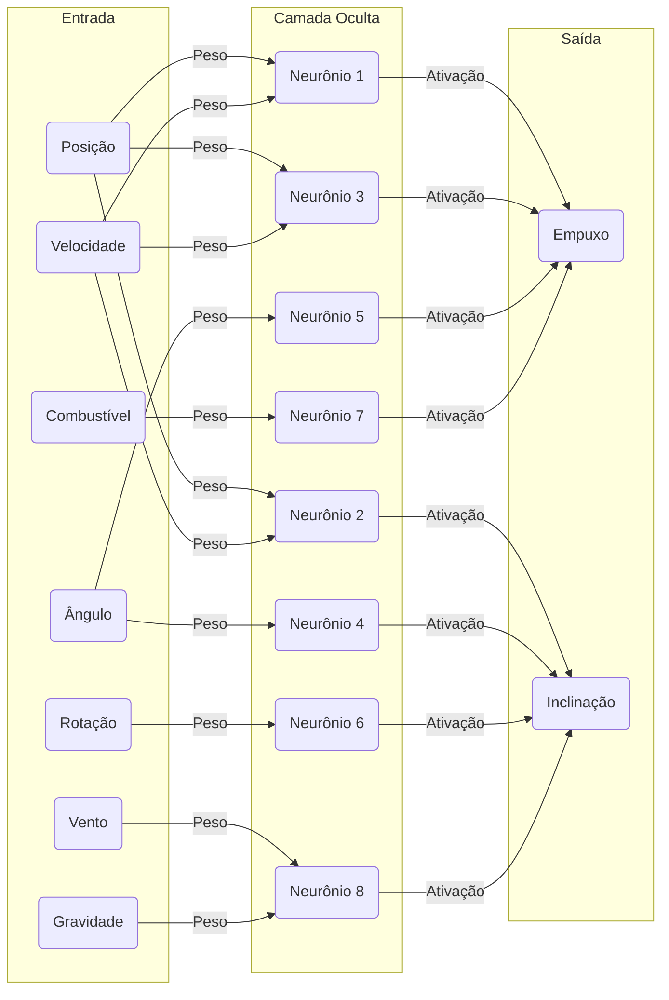

# 🚀 Rocket AI Simulation

## 📌 Descrição

Este projeto apresenta uma abordagem avançada para a simulação de veículos espaciais utilizando Inteligência Artificial (IA) para otimizar os processos de decolagem, navegação e pouso. A metodologia emprega **Redes Neurais Artificiais** e **Estratégias Evolutivas** para modelar e aperfeiçoar o comportamento do sistema ao longo de múltiplas iterações adaptativas.

## 📊 Diagrama da Rede Neural

Abaixo está um diagrama representando a arquitetura da rede neural utilizada para o controle do foguete:

```
        Entrada                Camada Oculta                Saída
   ┌───────────┐            ┌───────────┐            ┌───────────┐
   │  Posição  │───┐      ┌▶│  Neurônio │───┐      ┌▶│  Empuxo   │
   │ Velocidade│───┼──────┤ │  Oculto   │───┼──────┤ │ Inclinação│
   │  Ângulo   │───┼──────┤ │  Oculto   │───┼──────┘ └───────────┘
   │   Rotação │───┼──────┤ │  Oculto   │
   │ Combustível│───┼──────┤ │  Oculto   │
   │    Vento  │───┼──────┤ │  Oculto   │
   │ Gravidade │───┘      └▶│  Oculto   │
   └───────────┘            └───────────┘
```

A rede neural utilizada segue um modelo **feedforward**, onde os neurônios das camadas ocultas realizam cálculos para prever as melhores ações do foguete com base nos dados de entrada.

## 🎯 Objetivo

A simulação tem como propósito o desenvolvimento de um agente autônomo capaz de:

1. **Efetuar uma decolagem controlada**, minimizando desvios indesejados.
2. **Executar manobras de navegação para coleta de múltiplos pontos de interesse**.
3. **Realizar um pouso seguro e preciso em uma plataforma específica**, ajustando sua trajetória em tempo real.

## 🛠️ Tecnologias e Modelos Empregados

- **Python 3**
- **Simulação Física Computacional** (Dinâmica Newtoniana, Empuxo, Torque, Arrasto Aerodinâmico, Perturbações Atmosféricas)
- **Redes Neurais Artificiais Feedforward**
- **Métodos de Otimização Evolutiva** (Seleção, Crossover e Mutação)
- **Treinamento Supervisionado e Aprendizado por Reforço**

## 📂 Estrutura do Projeto

```
rocket-ai-simulation/
│── rocket_sim.py       # Implementação das equações de movimento e controle
│── environment.py      # Simulação do ambiente (vento, gravidade, obstáculos)
│── ai_trainer.py       # Algoritmo de aprendizado neural e evolução genética
│── main.py             # Loop de treinamento e validação
│── README.md           # Documentação do projeto
```

## 🚀 Execução da Simulação

### 1️⃣ Instalar Dependências

Para garantir a compatibilidade das bibliotecas utilizadas, instale os pacotes necessários:

```bash
pip install -r requirements.txt
```

### 2️⃣ Rodar a Simulação e Treinar a IA

```bash
python main.py
```

O treinamento ocorre iterativamente, onde a IA aprimora sua capacidade de controle por meio de métodos de otimização baseados em seleção e mutação genética. O processo pode exigir **centenas de gerações** para convergência ideal.

### 3️⃣ Ajuste de Parâmetros (Opcional)

É possível modificar variáveis como **intensidade dos ventos**, **quantidade de combustível inicial**, **capacidade de empuxo** e **distribuição da massa estrutural** para alterar a complexidade do problema e os desafios impostos ao modelo.

## 🧠 Estrutura do Aprendizado de Máquina



O processo de aprendizado da IA é baseado em um modelo de **rede neural artificial** acoplado a um **algoritmo de otimização evolutiva**, dividido nas seguintes etapas:

1. **Aquisição de Dados Sensoriais:**
   - O agente recebe dados contínuos sobre sua posição, velocidade, ângulo, taxa de rotação e nível de combustível.
2. **Tomada de Decisão via Rede Neural:**
   - O modelo computacional processa as informações e determina a magnitude do empuxo e a inclinação do foguete.
3. **Avaliação de Performance:**
   - Cada execução é quantificada por meio de métricas como:
     - Eficiência na coleta de pontos.
     - Precisão na estabilização da trajetória.
     - Sucesso no pouso dentro dos limites definidos.
4. **Otimização Genética:**
   - A otimização genética no treinamento da IA baseia-se na aplicação de algoritmos evolutivos inspirados na teoria da seleção natural. Os indivíduos mais bem-sucedidos em uma geração, avaliados com base em métricas como precisão do pouso e eficiência de trajetória, são selecionados para reprodução.
   - A reprodução ocorre por meio de **crossover**, onde os pesos das redes neurais dos pais são combinados para gerar novos indivíduos, permitindo a transmissão de características benéficas.
   - A mutação desempenha um papel crucial no aumento da diversidade genética, introduzindo pequenas variações aleatórias nos parâmetros dos novos indivíduos. Isso evita a estagnação em mínimos locais e permite a exploração de soluções mais eficientes.
   - O processo evolutivo se repete por múltiplas gerações, refinando progressivamente a capacidade da IA de controlar o foguete de forma otimizada.
5. **Iteração até a Convergência:**
   - O ciclo de aprendizado é repetido até que a IA atinja um nível aceitável de precisão e estabilidade nas manobras.

O processo de aprendizado da IA é baseado em um modelo de **rede neural artificial** acoplado a um **algoritmo de otimização evolutiva**, dividido nas seguintes etapas:

1. **Aquisição de Dados Sensoriais:**
   - O agente recebe dados contínuos sobre sua posição, velocidade, ângulo, taxa de rotação e nível de combustível.
2. **Tomada de Decisão via Rede Neural:**
   - O modelo computacional processa as informações e determina a magnitude do empuxo e a inclinação do foguete.
3. **Avaliação de Performance:**
   - Cada execução é quantificada por meio de métricas como:
     - Eficiência na coleta de pontos.
     - Precisão na estabilização da trajetória.
     - Sucesso no pouso dentro dos limites definidos.
4. **Otimização Genética:**
   - A otimização genética no treinamento da IA baseia-se na aplicação de algoritmos evolutivos inspirados na teoria da seleção natural. Os indivíduos mais bem-sucedidos em uma geração, avaliados com base em métricas como precisão do pouso e eficiência de trajetória, são selecionados para reprodução.
   - A reprodução ocorre por meio de **crossover**, onde os pesos das redes neurais dos pais são combinados para gerar novos indivíduos, permitindo a transmissão de características benéficas.
   - A mutação desempenha um papel crucial no aumento da diversidade genética, introduzindo pequenas variações aleatórias nos parâmetros dos novos indivíduos. Isso evita a estagnação em mínimos locais e permite a exploração de soluções mais eficientes.
   - O processo evolutivo se repete por múltiplas gerações, refinando progressivamente a capacidade da IA de controlar o foguete de forma otimizada.
5. **Iteração até a Convergência:**
   - O ciclo de aprendizado é repetido até que a IA atinja um nível aceitável de precisão e estabilidade nas manobras.

## 📌 Perspectivas para Extensões Futuras

- 🌐 **Visualização Gráfica e Simulação 3D** via bibliotecas como Pygame ou OpenGL.
- 🎮 **Módulo Competitivo Humano vs. IA** para validação comparativa.
- 🛰️ **Ambientes Dinâmicos Avançados**, incluindo diferentes atmosferas planetárias e perturbações ambientais estocásticas.

---

**Este projeto visa contribuir para o desenvolvimento de algoritmos autônomos aplicados ao controle de veículos espaciais em condições adversas. 🚀🔬**

